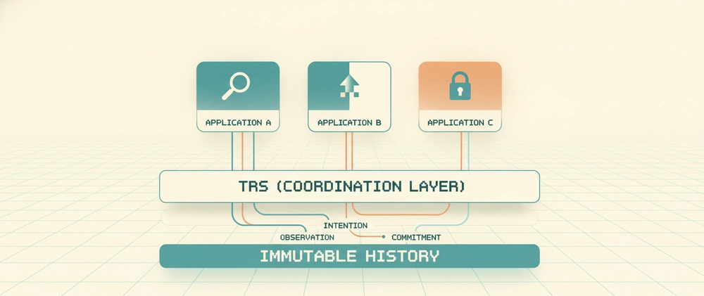

# TRS Runtime

TRS is a domain-neutral coordination and provenance runtime for distributed applications, organizations, devices, services, and AI agents.



## Why does this exist?

TRS started as an attempt to answer a simple question:

**Can heterogeneous systems share a common model for authority, causality, replay, and coordination without sharing the same application model?**

This repository is an exploration of that question.

## The Problem

Modern systems answer different parts of coordination:

- databases store state
- workflow engines orchestrate work
- event logs record events
- IAM controls access
- version control tracks code

But reconstructing **who was authorized**, **what happened**, **why systems disagree**, and **how events are causally connected** often requires stitching information together from multiple systems.

## What TRS Does

```text
Application
      |
      v
TRS Adapter
      |
      v
TRS Runtime
```

Applications keep their own domain data.  
TRS records coordination facts and relationships using:

- Observation
- Intention
- Commitment

## What TRS Is NOT

- Not a database
- Not a blockchain
- Not an event store
- Not a workflow engine
- Not a CRDT
- Not an AI framework
- Not a replacement for AWS, Kafka, or PostgreSQL

TRS is intended to complement existing systems.

## Example (one record)

```json
{
  "id": "p10-authority-bob",
  "type": "Commitment",
  "author": "alice",
  "timestamp": "2026-08-06T12:01:00Z",
  "schema": "trs.commitment.v1",
  "payload": {
    "action": "assign-authority",
    "due_by": "2026-08-10T00:00:00Z",
    "assignee": "bob"
  },
  "causes": ["p10-task-create"],
  "authorization": ["p10-task-create"],
  "signature": "sig:p10-authority-bob",
  "subject": "task-1001"
}
```

## Repository Structure

- `runtime/` - core TRS record model, verifier, storage, replay, graph, query, and sync logic.
- `terranode/` - consumer-side integration and validation programs over TRS.
- `trs-node/` - deployable network node/profile exposing runtime operations.
- `trs-sdk-python/` - Python SDK package and client flows.
- `trs-cli/` - command-line workflow tooling for TRS operations.
- `trs-explorer/` - inspection tools and explorer surfaces.
- `trs-conformance/` - implementation-neutral vectors and expected outcomes.
- `trs-openapi/` - canonical HTTP contract definition.
- `trs-grpc/` - canonical gRPC contract definition.
- `trs-interop/` - cross-runtime interoperability matrix and runs.
- `trs-formal/` - formal-method artifacts (TLA+ and model checks).
- `trs-independent-implementations/` - external implementation challenge and evidence intake.
- `terranode-program10/` - human-coordination comparison app, study assets, and report artifacts.
- `research/` - cycle records, evidence scoreboards, and outcomes ledger.
- `evidence/` - machine-readable and human-readable validation artifacts.
- `docs/` - frozen specification and traceability documents.

## Current Status

```text
Research Programs
--------------------------
[x] Runtime Specification
[x] Reference Runtime
[x] SDKs (baseline set)
[x] Node Profile
[x] CLI
[x] Explorer
[x] Conformance Suite
[x] Human Coordination Validation (implementation package)
[x] Independent Implementations (initial gate closure)
[x] OpenAPI + gRPC canonical contracts
[ ] Formal verification depth expansion
[ ] External security audit closure
[ ] Governance adoption cycle closure
[ ] Real-participant Program 10 validation closure
[ ] Ecosystem growth and onboarding expansion
```

## Independent Implementation Challenge

See [`trs-independent-implementations/`](trs-independent-implementations/).

Goal: implement TRS using only the specification artifacts (without reusing reference runtime internals), then run conformance and interop evidence.

## Authorship and Independence Disclosure

- This repository has been developed with human direction and AI-assisted coding support (including Copilot-assisted implementation work).
- "Independent implementation" in this project means implementation from the specification artifacts, without copying reference-runtime internals.
- Every independent implementation submission must disclose tooling used (including AI assistance) in its report and attestation.

## Looking For Feedback

I am not looking for stars. I am looking for answers to questions like:

- Does this solve a real coordination problem?
- What existing systems already solve this well?
- Where does the abstraction fail?
- Would you integrate this into an existing architecture?

Please leave feedback here:

- **GitHub Issues** for bugs and feature suggestions.
- **GitHub Discussions** (if enabled) for broader design discussion and opinions.

## Roadmap (remaining work)

- Complete real-participant Program 10 runs (5+ participants) and close CYCLE-0020.
- Expand formal verification scope/depth beyond current bounded runs.
- Complete external professional security audit cycle.
- Complete recurring multi-party governance adoption cycle.
- Expand SDK onboarding and ecosystem integrations.

## Operational and Positioning Notes

- Deployment guidance: [`docs/DEPLOYMENT_GUIDANCE.md`](docs/DEPLOYMENT_GUIDANCE.md)
- System comparisons: [`docs/TRS_COMPARISONS.md`](docs/TRS_COMPARISONS.md)
- App-layer boundary: [`docs/APP_LAYER_BOUNDARY.md`](docs/APP_LAYER_BOUNDARY.md)
- Design lineage addendum: [`docs/DESIGN_RECORD_LINEAGE_ADDENDUM.md`](docs/DESIGN_RECORD_LINEAGE_ADDENDUM.md)

## License

Apache-2.0. See [`LICENSE`](LICENSE).
